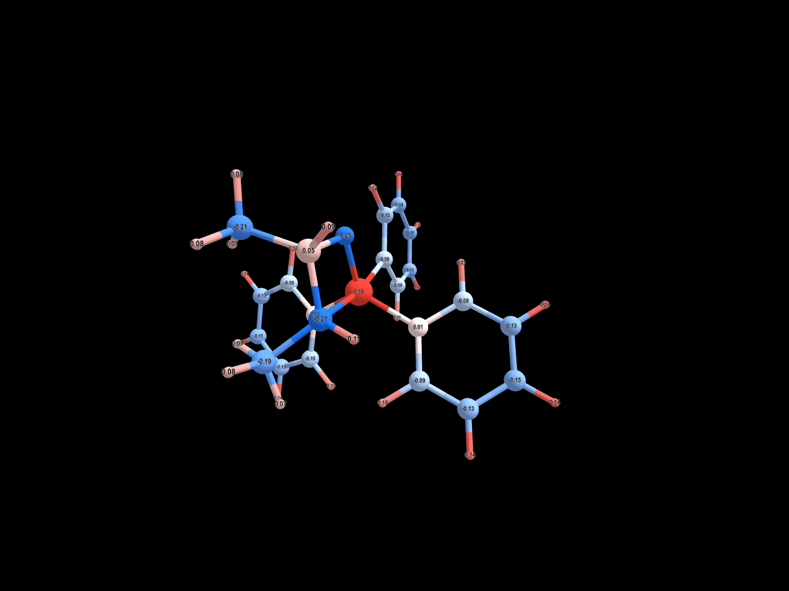
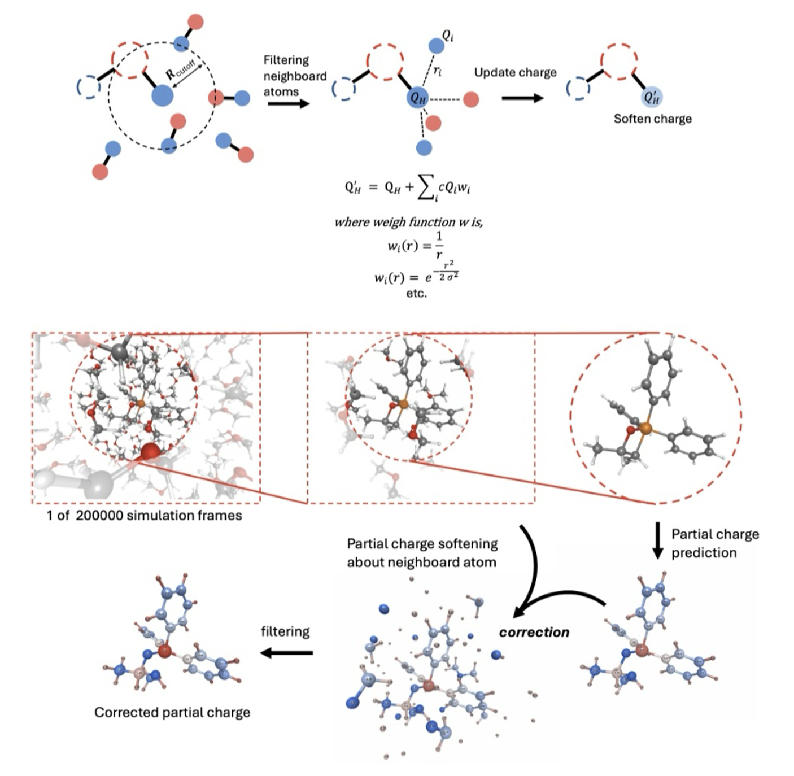

<p align="center">
  
</p>

# qsolv_softener

Charge softening for solute atoms based on solvent environment. (optionally with QEq)

## Overview

`qsolv_softener` is a Python package that softens partial charges on solute atoms by incorporating information from neighboring solvent atoms within a specified radius. After softening, it applies Charge Equilibration (QEq) to maintain the total system charge while allowing charges to re-equilibrate based on electronegativity and hardness parameters.

<p align="center">
  
</p>

## Features

- **Distance-weighted charge softening**: Multiple weight functions (inverse, Gaussian, inverse square)
- **QEq integration**: Maintains total charge conservation (within 1e-6 tolerance)
- **Flexible parameterization**: Customizable radius, mixing parameter (α), and weight function parameters
- **ASE integration**: Works seamlessly with ASE Atoms objects
- **Efficient neighbor search**: Uses KDTree for O(log N) neighbor queries
- **Filtered atoms**: Automatically creates a reduced system containing only solute + solvent atoms within the specified radius

## Installation

Using `uv` (recommended):

```bash
uv pip install git+https://github.com/kangmg/qsolv_softener.git
```

Or git clone:

```bash
git clone https://github.com/kangmg/qsolv_softener.git
cd qsolv_softener
uv pip install -e .
```

## Quick Start

```python
import numpy as np
from ase import Atoms
from qsolv_softener import ChargeSoftener

# Create your system (solute + solvent)
atoms = Atoms(...)  # Your ASE Atoms object

# Define solute indices and charges
solute_indices = [0, 1, 2]  # Indices of solute atoms
solute_charges = np.array([0.5, -0.3, 0.2])
solvent_charges = np.array([-0.8, 0.4, -0.8, 0.4, ...])

# Create softener and run
softener = ChargeSoftener(
    atoms=atoms,
    solute_indices=solute_indices,
    solute_charges=solute_charges,
    solvent_charges=solvent_charges,
    radius=3.0,  # Search radius in Angstroms
    alpha=0.5     # Mixing parameter
)

updated_atoms = softener.run(apply_qeq=False)
final_charges = updated_atoms.get_initial_charges()
```

## Weight Functions

Three weight functions are supported:

1. **Inverse Distance** (default): `w(r) = 1/r`
   ```python
   softener = ChargeSoftener(..., weight_func='inverse')
   ```

2. **Gaussian**: `w(r) = exp(-r²/(2σ²))`
   ```python
   softener = ChargeSoftener(
       ..., 
       weight_func='gaussian',
       weight_params={'sigma': 1.5}
   )
   ```

3. **Inverse Square**: `w(r) = 1/r²`
   ```python
   softener = ChargeSoftener(..., weight_func='inverse_square')
   ```

## Parameters

- `atoms`: ASE Atoms object with solute + solvent
- `solute_indices`: List or array of solute atom indices
- `solute_charges`: Array of initial solute charges
- `solvent_charges`: Array of initial solvent charges
- `radius`: Search radius for neighbors (default: 5.0 Å)
- `weight_func`: Weight function name (default: 'inverse')
- `weight_params`: Dict of parameters for weight function (default: {})
- `alpha`: Mixing parameter, 0 = full softening, 1 = no softening (default: 0.5)
- `qeq_params`: Custom QEq parameters (default: uses built-in values)


## Filtered Atoms

After running the softening workflow, the `ChargeSoftener` object provides access to a filtered system containing only the solute atoms and the solvent atoms that were within the specified radius:

```python
softener = ChargeSoftener(...)
updated_atoms = softener.run()

# Access filtered solvent indices (within radius)
print(softener.filtered_solvent_indices)

# Access filtered atoms object (solute + filtered solvent)
filtered_system = softener.filtered_atoms
print(f"Reduced system: {len(filtered_system)} atoms")

# The filtered_atoms object is a regular ASE Atoms object
# with charges already equilibrated - useful for:
# - Further QM calculations on a reduced system
# - Analysis of the local environment
# - Saving only relevant atoms for visualization
```

